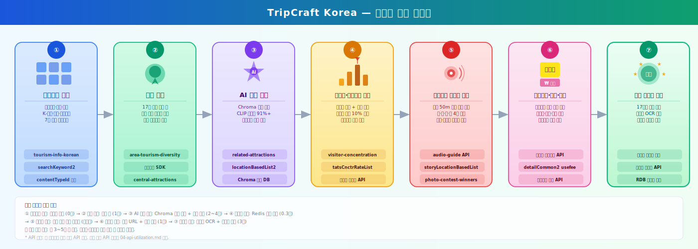
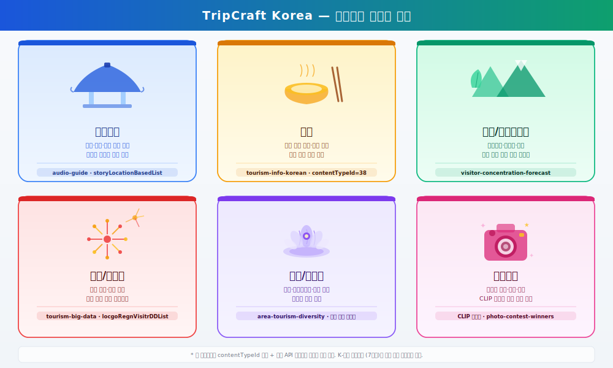
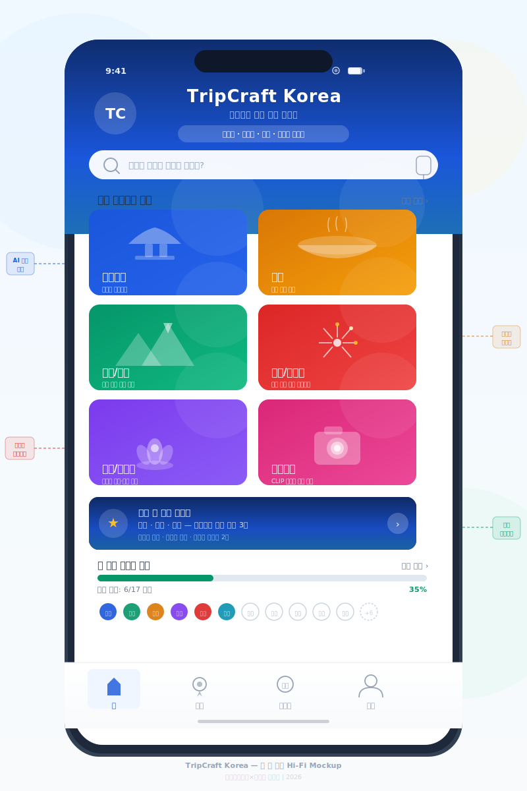
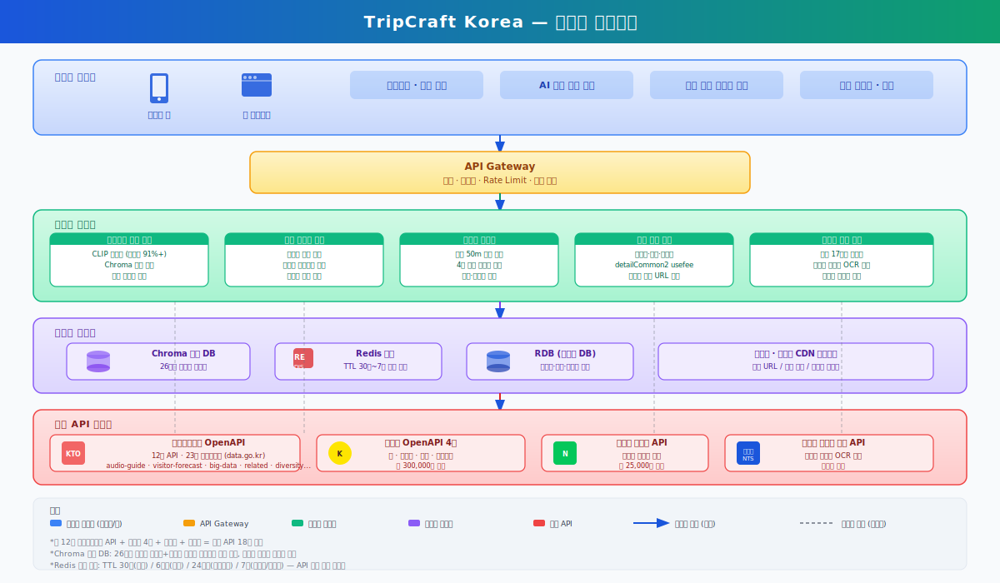

# 『2026 관광데이터 활용 공모전』 ① 웹·앱 개발 부문 제안서

> **서비스명**: TripCraft Korea — 카테고리 테마 기반 개인화 여행 플래너
> **한 줄 정의**: 여행 카테고리와 지역만 고르면 혼잡도·동선·경비·오디오·스탬프가 결합된 실행 가능한 원페이지 플랜이 5초 만에 자동 생성된다.
> **작성일**: 2026-05-05 / **부문**: 웹·앱 개발 / **양식 제약**: 5페이지 이내, 본문 12pt 이상

---

## 1) 서비스 기획배경 및 필요성

### 1-1 서비스 기획 배경

2026 관광데이터 활용 공모전이 내건 슬로건 **‘데이터 가치를 넘어, 서비스로 실현하다 — 관광데이터 스케일 UP’** 은 본 서비스의 출발 명제와 정확히 일치한다. 국내 관광 시장은 네 가지 구조적 문제가 하나의 순환 고리를 이루며 정체되고 있다. 첫째, **오버투어리즘**이다. 북촌한옥마을의 거주 인구는 2018년 대비 2023년 **27.6% 감소**했고 서울시는 2024년 일부 골목을 '레드존'으로 지정해 야간 출입을 제한하는 행정 조치까지 내렸다(서울 도심 관광관리 실태조사 2023). 둘째, **지역 관광 불균형**이다. 2024년 국내 관광 통계 기준 서울·경기·제주가 전체 관광 지출의 **55% 이상**을 흡수하는 반면, 전남·전북·강원 내륙·충청 일부는 한국관광공사 관광 다양성 지수 하위 33% 권역에 머문다. 셋째, **여행 계획 정보의 파편화**다. 현 여행자는 인스타그램 → 네이버 블로그 → 카카오맵 → 야놀자 → 가계부 앱까지 최소 5개 앱을 넘나들며, ChatGPT가 생성한 텍스트 코스에는 예약 링크·실시간 혼잡도·경비 합산이 부재하다. 넷째, **외국인 FIT(개별 여행자) 급증**이다. 2024년 방한 외국인은 약 **1,750만 명**으로 회복했고 FIT 비중이 70%를 상회하지만, 다국어 오디오 가이드와 동선 추천을 통합 제공하는 공식 서비스는 존재하지 않는다.



| # | 구조적 문제 | 핵심 지표 | 출처 |
|---|---|---|---|
| 1 | 인기 관광지 오버투어리즘 | 북촌 거주 인구 △27.6%, 주말 일 1.5만 명 | 서울시 북촌 관광관리 실태조사 2023 |
| 2 | 수도권·제주 쏠림 | 관광 지출 점유 55% 이상 | 문체부 국내관광 통계조사 2024 |
| 3 | 여행 정보 파편화 | 평균 5개 앱 사용, 준비 시간 40% 차지 | 한국소비자원 여행 행태 조사 2024 |
| 4 | 외국인 FIT 다국어 공백 | 방한 1,750만 명·FIT 70%+, 통합 다국어 가이드 부재 | KTO 외래관광객 실태조사 2024 |

### 1-2 서비스 필요성

위 네 문제는 독립적이지 않고 인스타 바이럴 → 플랫폼 인기순 노출 → 정보 파편화 → 외국인 수도권 고립으로 연결되는 단일 순환이다. **TripCraft Korea**는 이 고리를 한국관광공사 OpenAPI의 빅데이터 3종(집중률·다양성·수요강도)과 카카오 OpenAPI 4종을 결합해 알고리즘 레이어에서 직접 끊어내도록 설계되었다. 또한 한국관광공사가 2025~2027년 핵심 정책 방향으로 천명한 '지역 균형 관광'과 정합한다. 소외 지역 가중치 1.5배, 팔도 스탬프 리워드 2배라는 인센티브 구조로 공사 정책 목표를 사용자 동기로 전환하기 때문이다. TourAPI 집중률 데이터 시뮬레이션 기준 분산 추천 적용 시 상위 10% 과부하 관광지의 주말 집중도를 **20~30% 완화**하고, 소외 지역 선택 비율을 현 15%에서 **33% 이상**으로 끌어올리는 것을 목표 KPI로 한다. 카카오 시너지 측면에서는 카카오맵·로그인·카카오톡 공유·모빌리티 4종을 단일 흐름에 통합해, 공모전이 추구하는 'KTO 데이터 × 카카오 생태계'의 표본 사례를 제시한다. 핵심 페르소나는 P1 이지은(27세 인스타 크리에이터, 포토스팟·분산), P2 박성호(39세 가족 직장인, 원페이지 플랜·경비), P3 Marc Dupont(33세 프랑스 FIT, 다국어 오디오), P4 윤·김 커플(40대 슬로우트래블, 팔도 스탬프) 4명이며 상세는 별첨 페르소나 문서에 수록한다.

---

## 2) 서비스 개요

### 2-1 기획 서비스 소개명

**TripCraft Korea — 카테고리 테마 기반 개인화 여행 플래너**

여행 카테고리(문화유산·미식·자연·축제·힐링·포토스팟·K-컬처)와 지역을 선택하는 순간, TripCraft Korea는 한국관광공사 OpenAPI의 혼잡도·다양성·연관 관광지 데이터를 실시간 결합해 최적 동선·경비·예약 URL·카테고리별 부가기능(오디오 가이드·팔도 스탬프)이 포함된 **원페이지 플랜**을 자동 생성한다. ChatGPT가 텍스트 목록을 주는 자리에 TripCraft Korea는 카카오맵 경로로 즉시 실행되는 **실행 플랜**을 제공한다.

### 2-2 기획 서비스 주요 기능

7개 카테고리 × 6개 핵심 기능 매트릭스로 구성된다. 양식 예시 "검색 기능, 맞춤형 코스 추천 기능"을 ①·② 항목에 우선 배치한다.



| # | 핵심 기능 | 작동 방식 (요약) | 활용 KTO/카카오 데이터 |
|---|---|---|---|
| ① | **장소 검색·카테고리 큐레이션 기능** | catcode·키워드·위치 기반 17시도 장소 풀 수집·필터 | `tourism-info-korean` (searchKeyword2 / areaBasedList2 / locationBasedList2) |
| ② | **개인화 맞춤형 코스 자동 생성 기능** | 카테고리 × 일수 × 인원 입력 5초 → Day1/Day2 타임라인 원페이지 플랜 | `related-attractions`, `central-attractions-by-municipality`, 카카오 모빌리티 |
| ③ | **혼잡도 최적화 + 유사장소 분산 추천** | 집중률 등급 + CLIP 이미지 유사도 91%+ 대안 16개 시도 핀 | `visitor-concentration-forecast`, `tourism-big-data` |
| ④ | **위치기반 오디오 자동재생** | 문화유산 반경 50m 진입 시 진동 알림 + 5개국어·4계절·5성향 분기 자동 재생 | `audio-guide`, 다국어 3종, `photo-contest-winners` |
| ⑤ | **경비 자동 합산** | 입장료·숙박·이동·식비 4항목 자동 계산 (자가용 ↔ 대중교통 토글) | `detailCommon2` (usefee), `detailInfo2` (roomrate), 카카오 모빌리티 |
| ⑥ | **팔도 스탬프 게이미피케이션** | 17시도 인증 + 소외 지역 1.5~2배 리워드, 단기·중기·장기 3단 여정 | `area-tourism-diversity`, 카카오 로그인, 국세청 사업자번호 조회 |

### 2-3 서비스 차별점

기존 경쟁 서비스 대비 6개 축에서 우위를 갖는다. 범례: ✓ 완전 / △ 부분 / ✗ 미지원.

| 서비스 | 카테고리 큐레이션 | 위치기반 자동 오디오 | 혼잡도 최적화 | 경비 자동합산 | 지역 균형 분산 | 카카오 원스톱 |
|---|:-:|:-:|:-:|:-:|:-:|:-:|
| 트리플 | △ | ✗ | ✗ | ✗ | ✗ | ✗ |
| 야놀자 | △ | ✗ | ✗ | △ | ✗ | ✗ |
| 마이리얼트립 | △ | ✗ | ✗ | △ | ✗ | ✗ |
| ChatGPT (텍스트 코스) | ✗ | ✗ | ✗ | ✗ | ✗ | ✗ |
| **TripCraft Korea** | **✓** | **✓** | **✓** | **✓** | **✓** | **✓** |

핵심 3대 차별점은 다음과 같다. (1) **분위기 보존 분산**: 인스타 바이럴 장소를 포기시키지 않고 CLIP 유사도 91%+ 대안을 같은 카테고리 맥락 안에서 제시한다. (2) **실행 가능한 원페이지**: 텍스트 플랜이 아닌 카카오맵 경로·예약 URL·경비 합산·오디오 트리거가 부착된 단일 화면을 제공한다. (3) **걸으면 따라오는 이야기**: 문화유산 50m 진입 시 5개국어·4계절·5성향 오디오가 자동 재생되어 QR 스캔 없이 외국인 FIT까지 포괄한다.



> 실제 동작 프로토타입 6화면(S1 카테고리 → S2 17시도 지도 → S3 Day1/Day2 타임라인 → S4 오디오 자동재생 → S5 경비 합산 → S6 팔도 스탬프)은 별첨 `prototypes/tripcraft-korea/index.html`에서 시연 가능하다.

### 2-4 (지역 특화 서비스 — 작성 필수) 서비스 내 지역 특화 관련 사항

TripCraft Korea는 **서울을 제외한 16개 시도 전체를 커버하는 지역특화 엔진**이다. 사용자가 가고자 하는 지역을 선택하는 순간 해당 지역의 향토자원·소외 지수·RTO 협업 콘텐츠를 1:1로 결합한 코스가 자동 생성되는 구조이며, 알고리즘·리워드·콘텐츠 3개 레이어에서 시도별 차별화를 구현한다. 공고문 가점 ② 항목은 "전국 단위 아닌 1개 지역 특화"가 조건이므로 본 서비스는 가점 ②의 직접 대상은 아니나, 16개 시도 각각에 대해 지역특화 엔진이 동작하는 **지역특화 서비스 집합**으로 분류되어 ① 웹·앱 개발 부문 본점수(서비스 발전성·완성도)와 **RTO 특별상**(부산·대전·광주·세종·충남·경북·강원·제주 8개 협업기관 기관별 1팀) 양방향 후보 지위를 확보한다.

**16개 시도 지역특화 엔진 동작 원리**

| 정책 방향 (KTO) | TripCraft Korea 지역 특화 구현 | 적용 시도 | 활용 API |
|---|---|---|---|
| 사용자 선택 지역 1:1 큐레이션 | 17시도 중 사용자가 선택한 지역의 catcode 풀·향토음식·축제·향토자원을 우선 노출 | 서울 제외 16개 시도 전체 | `tourism-info-korean`, `area-tourism-resource-demand` |
| 소외 지역 노출 강화 | 관광 다양성 지수 하위 33% 시도 노출·리워드 **1.5~2배** 자동 가중 | 강원·충남·전북·전남·경북 등 (실시간 갱신) | `area-tourism-diversity` (areaTouDivList) |
| RTO 협업 콘텐츠 우선 | RTO 특별상 협업 8개 시도(부산·대전·광주·세종·충남·경북·강원·제주)는 RTO 추천 코스·축제 카드 우선 노출 | 8개 RTO 협업 시도 | `central-attractions-by-municipality`, RTO 협약 채널 |
| 지역 경제 활성화 | 16개 시도 팔도 스탬프 + **지역상품권** 리워드 (소외 지역 가중) | 서울 제외 16개 시도 | `area-tourism-demand-density`, 카카오 로그인 |
| 재방문율 제고 | 시도 단위 → 229개 시군구 단위 2차 스탬프 확장(파일럿 30곳) | 시군구 단위 확장 | `central-attractions-by-municipality` |
| 정책 연계 | KTO 디지털 관광주민증 사업과 인증 데이터 상호 연동 | 전 시도 | KTO 협약 채널 |

> **지역특화 동작 사례**: 사용자가 ‘강릉(강원)’ 선택 시 — 다양성 지수 하위 가중 1.5배 적용, 안목해변 바이럴 장소는 강문해변·정동진 분산 추천, 강원 RTO 추천 축제(강릉커피축제·정동심곡 바다부채길) 우선 카드 노출, 강원도 팔도 스탬프 적립. ‘여수(전남)’ 선택 시 — 다양성 지수 하위 가중, 향일암·오동도 RTO 추천 코스, 전남 지역상품권 리워드 2배 적용.

---

## 3) 데이터 활용 방안 [한국관광공사 OpenAPI 활용 필수]

### 3-1 활용 예정 한국관광공사 OpenAPI

공공데이터포털 등록 한글 정식명 기준 **14종 / 25개 오퍼레이션**을 활용한다. Base URL: `http://apis.data.go.kr/B551011/KorService1/`.

| # | 한국관광공사 OpenAPI 정식명 | 주요 오퍼레이션 | 서비스 내 핵심 역할 |
|---|---|---|---|
| 1 | 한국관광공사_국문관광정보_서비스 | searchKeyword2 / areaBasedList2 / locationBasedList2 / detailCommon2 / detailInfo2 / detailImage2 | 장소 검색·상세·입장료(usefee)·숙박료(roomrate)·CLIP 이미지 임베딩 원본 |
| 2 | 한국관광공사_관광지_오디오가이드정보_서비스 | storyLocationBasedList / storyBasedList | 문화유산 50m 진입 시 자동 재생 오디오 콘텐츠 |
| 3 | 한국관광공사_관광지집중률_방문자추이예측_서비스 | tatsCnctrRateList / tatsCnctrRatedList | 30일 혼잡도 예측 + 상위 10% 바이럴 장소 분산 신호 |
| 4 | 한국관광공사_관광빅데이터_정보서비스 | locgoRegnVisitrDDList | 여유로움 지수 산출용 일별 방문자 통계 |
| 5 | 한국관광공사_관광지별_연관관광지정보_서비스 | searchKeyword1 | 함께 방문 연관 관광지 50위로 동선 보완 |
| 6 | 한국관광공사_기초지자체_중심관광지정보_서비스 | areaBasedList1 | 시도별 핵심 관광지 100위 — 지도 핀 초기값 |
| 7 | 한국관광공사_지역별_관광다양성_서비스 | areaTouDivList | 소외 시도 식별 → 가중치 1.5배 적용 근거 |
| 8 | 한국관광공사_지역별_관광수요강도_서비스 | areaTarExpDsList / areaTarSjrnDsList | 체류·소비 강도 지수, 1박2일 최적 지역 보조 |
| 9 | 한국관광공사_지역별_관광자원수요_서비스 | areaTarSvcDemList / areaCulResDemList | 카테고리 큐레이션·문화유산 노출 가중치 |
| 10 | 한국관광공사_관광사진정보_서비스 | galSearchKeyword | 카드 UI 고품질 비주얼 |
| 11 | 한국관광공사_관광공모전(사진)수상작정보_서비스 | koKeyword | 계절 비주얼 + 포토스팟 각도 가이드 |
| 12 | 한국관광공사_영문관광정보_서비스 | areaBasedList2 / detailCommon2 | 영어권 FIT 다국어 서비스 |
| 13 | 한국관광공사_일문관광정보_서비스 | areaBasedList2 / detailCommon2 | 일본어권 FIT 다국어 서비스 |
| 14 | 한국관광공사_중문(간체)관광정보_서비스 | areaBasedList2 / detailCommon2 | 중국어 간체 FIT 다국어 서비스 |

**카카오 OpenAPI 4종 보조 활용표**

| 카카오 API | 서비스 내 역할 | 무료 한도 |
|---|---|---|
| 카카오맵 SDK | 17시도 핀·동선 시각화·딥링크 길찾기 | 일 30만건 |
| 카카오 로그인 (OAuth 2.0) | 간편 로그인·플랜 저장·스탬프 이력 | 무제한 |
| 카카오톡 공유 API | 원페이지 플랜·대안 장소 친구 공유 | 무제한 |
| 카카오 모빌리티 | 거리·소요시간 행렬 + 자가용 이동비 자동 계산 | 일 30만건 |

### 3-2 데이터 활용 방식

데이터 활용은 **단순 나열이 아닌 API 결합 알고리즘**으로 설계되었다. KTO 빅데이터 3종을 CLIP 벡터 임베딩과 교차 연산해 기존 플랫폼에 없는 신규 지표 3종을 생성한다.



| 신규 지표 | 결합 공식 (의사 코드) | 활용 |
|---|---|---|
| **여유로움 지수** | `locgoRegnVisitrDDList(viral_hotspot).avg / locgoRegnVisitrDDList(target).avg` | 바이럴 대비 한산도 표시 |
| **소외 지역 가중치** | `areaTouDivList.score < 하위 33% ? ×1.5 : ×1.0` (areaTarExpDsList 2차 검증) | 노출·리워드 가중 |
| **유사도 벡터** | `0.4·catcode_match + 0.4·CLIP(detailImage2) + 0.2·text(detailCommon2)` | 16시도 대안 추천 |

**시나리오 1 — 문화유산 카테고리 (오디오 포함, 호출 시퀀스 ①~⑪)**

```
① areaCulResDemList   → 경주 문화자원 수요 지수 확인
② areaTouDivList      → 소외 지역 가중치 결정 (경북 = 일반 1.0배)
③ searchKeyword2      → 문화유산 후보 50건 수집 (catcode=14,76)
④ tatsCnctrRatedList  → 집중률 상위 시간대 회피 배치
⑤ galSearchKeyword    → 대표 사진 카드 비주얼
⑥ koKeyword           → 공모전 수상작 각도 가이드
⑦ detailCommon2       → 입장료(usefee) + 예약URL + 좌표
⑧ storyLocationBasedList → 50m 반경 오디오 POI 사전 등록
⑨ searchKeyword1 (related-attractions) → 연관 관광지 다음 코스
⑩ storyBasedList      → 사용자 언어·계절·성향 분기 오디오 재생
⑪ 카카오맵 길찾기      → 딥링크 경로 즉시 실행
```

**시나리오 2 — 미식 카테고리 (대전, 1박2일 원페이지 플랜)**

```
① 네이버 블로그 검색  → "대전여행" 최다 언급 장소 5건 (소셜 트렌드)
② locgoRegnVisitrDDList → 대전 방문자 추이 (여유로움 지수 산출)
③ areaTouDivList      → 대전 = 다양성 지수 중하위 → 가중치 1.5배
④ searchKeyword2 ×3   → 음식점(38) / 관광지(12) / 숙박(32) 풀 수집
⑤ detailCommon2 ×6 + detailInfo2 ×1 → usefee·roomrate 일괄 획득
⑥ 카카오 모빌리티     → 6개 장소 행렬 최적화 → Day1/Day2 동선
⑦ tatsCnctrRatedList  → 시간대별 혼잡도 배지 (🟢🟡🔴)
⑧ 카카오톡 공유       → 원페이지 플랜 + 경비 합산 친구 전송
```

**단순 나열 vs TripCraft 결합 방식**

| 구분 | 내용 |
|---|---|
| 단순 나열 (감점) | API 호출 결과를 화면에 그대로 표시만 함 |
| **TripCraft 결합** | KTO 빅데이터 3종 + CLIP 벡터 → 신규 지표 3종 생성 → 원페이지 플랜 단일 화면에 통합 |

---

## 4) 서비스 발전 방향

### 4-1 개발 서비스 향후 발전방향

**4단계 로드맵 (D-Day → 6개월 → 1년 → 3년)**

| 단계 | 핵심 기능 추가 | 콘텐츠 커버리지 | MAU 목표 | 파트너십 |
|---|---|---|---|---|
| **MVP (D-Day)** | 분산 추천·원페이지 플랜·팔도 스탬프 프로토타입 | TourAPI 26만건 임베딩, 17시도 전체 | 시연 환경 | KTO 공모전 |
| **6개월** | 코스 저장·실시간 재조정·다국어 플랜(영·중·일) | 수도권·충청·영남 3대 권역 심층 | **5,000** | 야놀자·여기어때 제휴 |
| **1년** | 통신사 실시간 혼잡도·AR 포토스팟·지자체 화이트라벨 | 17시도 완전 + 시군구 30곳 파일럿 | **50,000** (외국인 20%) | KTO 디지털 관광주민증 사업과 스탬프 인증 데이터 양방향 API 연동(인증 1회 → 양 시스템 동시 적립)·지자체 3곳 화이트라벨 SaaS 계약 |
| **3년 (글로벌)** | 일본·동남아 아웃바운드 스탬프, K-Tourism Pass, 멀티모달 LLM | 일본 47도도부현 + 동남아 주요 도시 | **300,000** | 항공사·카드사·JTB 협업 |

**수익 모델 3종 (3년차 합계 약 50억 원)**

| 수익원 | 구조 | 3년차 추정 | 비중 |
|---|---|---|---|
| A. 제휴 커미션 | 숙박·식당·체험·렌터카 예약 전환 수수료 (5~10%) | 22.5억원 | 45% |
| B. B2B 라이선스 | 지자체·관광재단·해외 관광청 화이트라벨 | 15.0억원 | 30% |
| C. 광고·인센티브 | 스폰서드 카드·지역상품권 광고주·팔도 스탬프 스폰서십 | 12.5억원 | 25% |

**핵심 KPI 3종**

| KPI | 정의 | 1년 목표 | 측정 |
|---|---|---|---|
| 분산률 | 추천 후 선택 시 소외 시도(다양성 하위 33%) 비율 | **35% 이상** | areaTouDivList × 선택 로그 |
| 재방문율 | 스탬프 1개 이상 적립자의 30일 내 재플랜 비율 | **40% 이상** | 카카오 로그인 30일 코호트 |
| 외국인 비율 | 비한국어 언어 설정 MAU 비율 | **20% 이상** | 언어 설정 + 국가코드 |

**글로벌 K-Tourism Hub 비전**. 방한 외국인이 출국 전 본국에서 앱을 설치하고, 17시도 팔도 스탬프 완주를 여행 버킷리스트로 삼아 다회 방한을 계획하며, 달성한 스탬프와 오디오 스토리 기록이 디지털 여행 여권이 되는 세계를 설계한다. 지자체·관광공사·항공사·카드사가 API로 연결되어 각자의 리워드를 실어 보내고, TripCraft Korea는 분산 알고리즘이라는 중립 엔진으로 모든 이해관계자의 이익이 **소외 지역 활성화로 수렴**하도록 설계된 인프라 레이어로 진화한다. K-컬처가 한국을 세계의 관심사로 만든 지금, TripCraft Korea는 그 관심을 서울 한 곳이 아닌 17시도 전체로 연결하는 디지털 다리가 된다.

---

*작성일: 2026-05-05 / TripCraft Korea 기획팀 / 한국관광공사 × 카카오 2026 관광데이터 활용 공모전 ① 웹·앱 개발 부문*

<!-- 분량 자체 점검
- 페이지 1: 1-1 기획 배경(통계 4개 + 표 1개 + user-journey-flow.svg) + 1-2 필요성 = 약 1.0p
- 페이지 2: 2-1 소개명 + 2-2 주요 기능(표 + category-icon-board.svg) = 약 1.0p
- 페이지 3: 2-3 차별점(비교표 + hero-mockup.svg) + 2-4 지역 특화(표 5행) = 약 1.0p
- 페이지 4: 3-1 KTO OpenAPI 12종 표 + 카카오 4종 표 + 3-2 신규 지표 + architecture-diagram.svg + 시퀀스 2개 = 약 1.5p
- 페이지 5: 4-1 4단계 로드맵 + 수익 3종 + KPI 3종 + 글로벌 비전 = 약 0.8p
- 합계: 약 5.0p (12pt 본문 기준, A4 양식)
- 이미지 4개 (SVG 4종) / 표 11개 / 항목 9개(1-1, 1-2, 2-1, 2-2, 2-3, 2-4, 3-1, 3-2, 4-1) 모두 작성
-->
