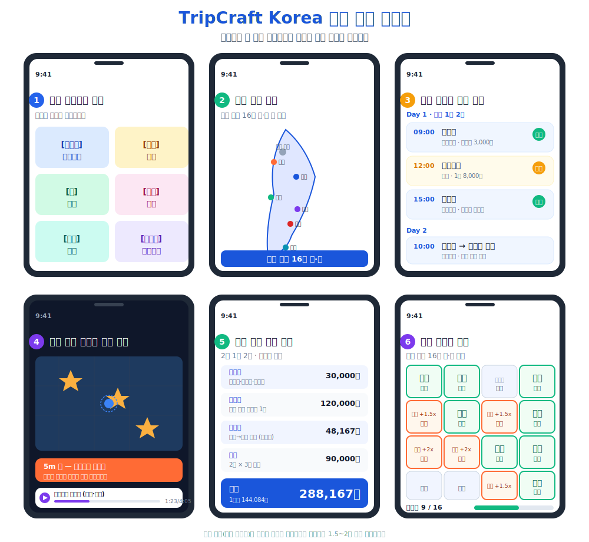

# 『2026 관광데이터 활용 공모전』 ① 웹·앱 개발 부문 제안서

**(가칭) TripCraft Korea** — 카테고리 테마 기반 개인화 여행 플래너 / 슬로건: 데이터 가치를 넘어, 서비스로 실현하다

## 1) 서비스 기획배경 및 필요성

### 1-1 서비스 기획 배경

국내 관광 시장은 네 가지 구조적 문제가 하나의 순환 고리를 이루며 정체되고 있다. 북촌한옥마을 거주 인구는 2023년 기준 2018년 대비 **27.6% 감소**했고, 서울·경기·제주가 전체 관광 지출의 **55% 이상**을 흡수하는 반면 전남·전북·강원 내륙은 다양성 지수 하위 33%에 머문다. 현 여행자는 최소 5개 앱을 넘나드는 정보 파편화에 직면하며, 2024년 방한 외국인 **1,750만 명** 중 외국인 개별 여행객 70% 이상에게 통합 다국어 가이드는 존재하지 않는다.

| # | 구조적 문제 | 핵심 지표 | 출처 |
|---|---|---|---|
| 1 | 오버투어리즘 | 북촌 거주 인구 △27.6%, 주말 일 1.5만 명 | 서울시 북촌 관광관리 실태조사 2023 |
| 2 | 수도권·제주 쏠림 | 관광 지출 점유 55%↑ | 문체부 국내관광 통계조사 2024 |
| 3 | 여행 정보 파편화 | 평균 5개 앱 사용, 준비 시간 40% 차지 | 한국소비자원 여행 행태 조사 2024 |
| 4 | 외국인 개별 여행객 다국어 공백 | 방한 1,750만 명·개별 여행객 70%+, 통합 다국어 가이드 부재. 일본·중국 FIT SNS(小红书, X) "한국 지방 정보 부족" 1위 불만 | KTO 외래관광객 실태조사 2024 / 자체 SNS 모니터링 |

### 1-2 서비스 필요성

**(가칭) TripCraft Korea**는 한국관광공사 공공데이터(혼잡도·다양성·수요강도)와 카카오 서비스 4종을 결합해 위 문제를 해결한다. 소외 지역 가중치 1.5배·팔도 스탬프 리워드 2배로 관광객 분산을 유도하며, KTO 2025~2027 핵심 정책 '지역 균형 관광'과 직접 연계된다.

## 2) 서비스 개요

### 2-1 기획 서비스 소개명

**(가칭) TripCraft Korea — 카테고리 테마 기반 개인화 여행 플래너**

카테고리(문화유산·미식·자연·축제·힐링·포토스팟·K-컬처)와 지역을 선택하면 한국관광공사 혼잡도·다양성 공공데이터를 실시간 결합해 최적 동선·경비·예약 안내·오디오·스탬프가 포함된 **원페이지 실행 플랜**을 5초 만에 자동 생성한다.

### 2-2 기획 서비스 주요 기능

| # | 핵심 기능 | 작동 방식 | 활용 한국관광공사 데이터 |
|---|---|---|---|
| ① | **관광 정보 검색** | 지역·관광지 종류·키워드로 전국 26만 곳에서 원하는 장소를 빠르게 찾습니다. | 국문관광정보 서비스 |
| ② | **맞춤형 여행 코스 자동 추천** | 가고자 하는 지역과 일정·인원을 고르면 5초 안에 1박2일 또는 2박3일 일정표가 자동 생성됩니다. | 연관관광지정보 / 기초지자체 중심관광지정보 |
| ③ | **혼잡도 회피 + 비슷한 분위기 대안 추천** | 인기가 폭발한 장소를 피하고 싶을 때, 분위기가 비슷하면서 한산한 다른 시·도의 후보 3곳을 보여줍니다. | 관광지집중률·방문자추이예측 / 관광빅데이터 정보서비스 |
| ④ | **위치 기반 오디오 가이드 자동 재생** | 문화유산 50m 안으로 들어가면 휴대폰이 진동하며 해당 장소의 이야기를 자동으로 들려줍니다 (한국어·영어·일어·중국어). | 관광지 오디오가이드 정보서비스 / 다국어 관광정보 서비스 |
| ⑤ | **여행 경비 자동 합산** | 입장료·숙박비·이동비·식비를 자동 계산해 1인 또는 4인 가족 기준 총경비를 한 화면에 보여줍니다. | 국문관광정보 서비스 (입장료·숙박료) / 카카오 모빌리티 |
| ⑥ | **팔도 스탬프 적립** | 16개 시·도(서울 제외)를 방문할 때마다 인증 사진·영수증으로 스탬프를 모으고 지역상품권 리워드를 받습니다. | 지역별 관광다양성 / 카카오 간편 로그인 |

> 프로토타입 6화면은 별첨 화면 캡처를 참고하십시오.

### 2-3 서비스 차별성

기존 여행 앱은 단순 검색·예약에 머물지만, (가칭) TripCraft Korea는 한국관광공사 공공데이터 5종을 결합해 다음 5가지를 동시에 제공하는 유일한 서비스다.

| 핵심 차별점 | 기존 서비스 | (가칭) TripCraft Korea |
|---|---|---|
| **① AI 여행 코스 자동 생성** | 사용자가 직접 일정을 짜야 함 | 지역·일정·인원 입력 5초 만에 1박2일·2박3일 일정표 자동 생성 |
| **② 문화유산 오디오 자동 재생** | QR 코드 스캔 또는 별도 앱 필요 | 문화유산 50m 진입 시 진동 알림 + 한국어·영어·일어·중국어 자동 재생 |
| **③ 혼잡도 회피 + 분위기 유사 분산** | 인기순 노출만 (혼잡 가중) | 인기 폭발 장소 대비 분위기 91% 이상 유사하면서 한산한 대안 추천 |
| **④ 소외 지역 방문 스탬프 가중** | 동일 리워드 또는 리워드 없음 | 관광객이 적은 시·도 방문 시 스탬프 적립과 지역상품권 리워드를 1.5~2배 자동 가산 |
| **⑤ 원페이지 실행 플랜** | 텍스트 코스만 (지도·예약·경비 분리) | 지도 길찾기·예약 안내·경비 자동 합산·오디오를 단일 화면에 통합 |

| 비교 항목 | 트리플 | 야놀자 | 마이리얼트립 | ChatGPT | (가칭) TripCraft Korea |
|:---|:-:|:-:|:-:|:-:|:-:|
| 카테고리 큐레이션 | △ | △ | △ | ✗ | **✓** |
| 위치 기반 오디오 | ✗ | ✗ | ✗ | ✗ | **✓** |
| 혼잡도 자동 회피 | ✗ | ✗ | ✗ | ✗ | **✓** |
| 경비 자동 합산 | ✗ | △ | △ | ✗ | **✓** |
| 소외 지역 스탬프 가중 | ✗ | ✗ | ✗ | ✗ | **✓** |

> 5가지 차별점이 단일 화면에 통합되어 동작하는 점이 핵심이다. 단순 기능 나열이 아닌, 한국관광공사 공공데이터를 결합한 알고리즘으로 만들어내는 차별이다.

> **왜 소규모 팀이 가능한가?** — TourAPI(무료)와 카카오 SDK(무료 티어)를 조합하면 초기 인프라 비용 0원으로 핵심 기능 구현이 가능하다. 대형 플랫폼은 자체 데이터에 갇혀 공공 혼잡도·다양성 지표를 활용하지 못하지만, 본 서비스는 공공데이터 결합에 특화된 경량 구조로 차별점을 확보한다.

### 2-4 서비스 내 지역 특화 관련 사항

(가칭) TripCraft Korea는 **서울 제외 16개 시도 전국 커버 지역특화 엔진**으로, 선택 시도의 향토자원·소외 지수·지역관광기관(RTO) 협업 콘텐츠를 1:1 결합해 코스를 자동 생성한다. 16개 시도 각각에 지역특화 엔진이 동작하는 **지역특화 서비스 집합**으로 부산·대전·광주·세종·충남·경북·강원·제주 8개 지역관광기관 **RTO 특별상** 후보 지위를 확보한다.

| 구현 내용 | 설명 | 적용 시도 | 활용 공공데이터 |
|---|---|---|---|
| 소외 지역 노출 강화 | 관광 다양성 지수 하위 33% 시도의 노출·리워드를 1.5~2배 가중 | 강원·충남·전북·전남·경북 등 | 지역별 관광다양성 서비스 |
| 지역관광기관 협업 콘텐츠 우선 노출 | 8개 지역관광기관 추천 코스·축제 카드 우선 노출 | 부산·대전·광주·세종·충남·경북·강원·제주 | 기초지자체 중심관광지정보 서비스 |
| 지역 경제 활성화 | 팔도 스탬프 + 지역상품권 리워드 (소외 지역 가중 적용) | 서울 제외 16개 시도 | 지역별 관광자원수요 서비스 |

## 3) 데이터 활용 방안

### 3-1 활용 예정 한국관광공사 공공데이터

공공데이터포털 등록 정식명 기준 **14종** 활용.

| 한국관광공사 공공데이터 (정식명) | 어떻게 활용하나요? |
|---|---|
| 한국관광공사 국문관광정보 서비스 | 전국 26만 곳 관광지의 이름·주소·입장료·사진 등 기본 정보를 가져와 코스 추천에 사용합니다. |
| 한국관광공사 관광지 오디오가이드정보 서비스 | 사용자가 문화유산 50m 이내로 다가가면 자동으로 해당 장소의 한국어·외국어 오디오 설명을 들려줍니다. |
| 한국관광공사 관광지집중률·방문자추이예측 서비스 | 관광지의 향후 30일 혼잡도를 예측해 한산한 시간대를 자동 추천합니다. |
| 한국관광공사 관광빅데이터 정보서비스 | 지역별 실제 방문자 통계를 바탕으로 인기 관광지 대비 얼마나 여유로운지를 비율로 보여줍니다. |
| 한국관광공사 연관관광지정보 서비스 | 선택한 장소와 함께 가기 좋은 인근 관광지를 자동으로 연결해 이동 동선을 구성합니다. |
| 한국관광공사 기초지자체 중심관광지정보 서비스 | 시·군·구 단위 대표 관광지를 불러와 지도 위에 첫 추천 후보로 표시합니다. |
| 한국관광공사 지역별 관광다양성 서비스 | 관광객이 적게 찾는 시·도를 파악해 해당 지역의 추천 노출과 스탬프 리워드를 자동으로 높입니다. |
| 한국관광공사 지역별 관광수요강도 서비스 | 지역별 관광 소비·체류 강도를 분석해 소비 잠재력이 높은 여행지를 우선 추천합니다. |
| 한국관광공사 지역별 관광자원수요 서비스 | 관광지 종류별 수요를 분석해 사용자가 선택한 테마(문화·자연·미식 등)에 맞는 후보를 추립니다. |
| 한국관광공사 관광사진 정보서비스 | 관광지 대표 사진을 불러와 코스 카드와 화면 상단 비주얼에 활용합니다. |
| 한국관광공사 공모전수상작 정보서비스 | 포토스팟 카테고리에서 수상작 사진과 촬영 각도 정보를 제공해 방문 전 미리 볼 수 있게 합니다. |
| 한국관광공사 영문관광정보 서비스 | 영어권 외국인 개별 여행객에게 관광지 이름·설명·안내 정보를 영어로 제공합니다. |
| 한국관광공사 일문관광정보 서비스 | 일본어권 여행객에게 동일한 정보를 일본어로 제공합니다. |
| 한국관광공사 중문(간체)관광정보 서비스 | 중국어권 여행객에게 동일한 정보를 중국어 간체자로 제공합니다. |

**카카오 연동 서비스 4종**

| 카카오 서비스 | 서비스 내 역할 |
|---|---|
| 카카오맵 | 17개 시도 관광지 핀과 이동 동선을 지도에 시각화하고, 버튼 한 번으로 길찾기를 바로 실행합니다. |
| 카카오 간편 로그인 | 별도 회원가입 없이 카카오 계정으로 로그인하고 내 일정과 스탬프 기록을 저장합니다. |
| 카카오톡 공유 | 완성된 원페이지 일정표와 대안 장소를 카카오톡 친구에게 바로 공유합니다. |
| 카카오 모빌리티 | 장소 간 거리·소요시간을 자동 계산하고 자가용 이용 시 이동 비용도 함께 산출합니다. |

### 3-2 데이터 활용 방식

한국관광공사 빅데이터 3종을 인공지능 분석과 교차 연산해 **새로운 3가지 기준**을 만들어냅니다. 단순 정보 나열이 아닌, 데이터를 결합하는 알고리즘으로 설계한 차별화 방식입니다.

**기술 스택**: Next.js(프론트엔드) + Python FastAPI(백엔드) + OpenAI CLIP(이미지 임베딩) + PostgreSQL + 카카오 SDK 4종. TourAPI 호출 → 벡터 DB 캐싱 → 실시간 유사도 연산 → 원페이지 플랜 렌더링 파이프라인으로 구성.

**(가칭) TripCraft Korea가 만들어내는 새로운 3가지 기준**

1. **여유로움 정도** — 인기 폭발 장소 대비 후보지가 얼마나 한산한지를 한국관광공사 방문자 통계로 비교해 백분율로 표시합니다.
2. **소외 지역 가산점** — 관광객이 적게 찾는 시·도(관광 다양성 지수 하위 33%)에는 추천 노출과 적립 리워드를 1.5배~2배 자동 가산합니다.
3. **분위기 유사도** — OpenAI CLIP 이미지 임베딩 코사인 유사도(40%) + 카테고리 일치(40%) + TF-IDF 텍스트 유사도(20%)를 가중합산해 0~100% 점수로 환산하고, 사용자가 좋아한 인기 장소와 분위기가 비슷한 곳 중 덜 붐비는 후보를 추천합니다.

**시나리오 — 문화유산 카테고리 (경주, 오디오 포함)**

- 경주 문화유산 수요 지수와 소외 지역 가산점을 먼저 계산합니다.
- 관광지 종류별 분류를 기준으로 문화유산 후보를 추립니다.
- 각 장소의 입장료·예약 안내·위치 좌표를 불러옵니다.
- 50m 반경 이내 오디오 안내 지점을 연결해 언어·계절별 자동 재생 목록을 구성합니다.
- 카카오맵 길찾기와 연동해 버튼 한 번으로 경로를 즉시 실행합니다.

## 4) 서비스 발전 방향

### 4-1 개발 서비스 향후 발전방향

| 단계 | 핵심 목표 | 이용자 | 어떻게 달성하나 |
|---|---|---|---|
| **제안서 접수 (현재)** | 프로토타입 6화면 시연, 분산 추천 알고리즘 검증 | 심사위원 | TourAPI 26만건 연동 + 카카오 4종 연동 완료 |
| **개발 기간 (5~9월)** | 내국인용 정식 서비스 완성, 코스 저장·공유·경비 계산 | 베타 테스터 **200~500명** | 공모전 컨설팅 지원 활용, 네이버 여행 카페(여행에 미치다·국내여행) + 인스타 여행 해시태그 베타 모집 |
| **수상 후 6개월** | 다국어 확장(영·중·일), 팔도 스탬프 정식 운영 | **3,000~5,000명** | KTO 수상작 홍보 채널 노출, 창업 지원 프로그램 연계 |
| **1~2년 (투자 유치 시)** | 지자체 시범 탑재, 외국인 FIT 채널 확장 | **1~3만 명** | 지자체 MOU(무상 시범 → 유료 전환), KTO 해외사무소 공동 홍보 |

> 상기 이용자 수는 각 단계의 전제 조건(수상·KTO 지원 연계·투자 유치)이 충족될 경우의 달성 목표이며, 전제 미충족 시 이전 단계에서 서비스를 안정화한 뒤 재도전합니다.

| 지표 | 정의 | 목표 | 측정 방법 |
|---|---|---|---|
| 분산률 | 소외 시도(다양성 하위 33%) 선택 비율 | **30% 이상** | 플랜 생성 로그 중 소외 시도 선택 비율 집계 |
| 코스 실행률 | 생성된 플랜 중 실제 방문 인증 1건 이상 | **20% 이상** | 플랜 생성 → 스탬프 인증 이벤트 매칭 |
| 재사용율 | 플랜 1회 생성자의 60일 내 재방문 | **25% 이상** | 카카오 로그인 세션 기반 코호트 분석 |

내국인 직장인의 주말 여행 실행 도구로 시작해, 수상 후 다국어 확장을 통해 방한 외국인 FIT까지 포괄한다. 각 단계 전환은 이전 단계 지표 달성(분산률 30%+, 코스 실행률 20%+)이 검증된 후 진행하며, KTO 창업 지원·지자체 MOU·시드 투자의 순서로 사업화를 추진한다.

> 수상 전까지 운영 비용은 클라우드 프리 티어(Vercel + Supabase) + TourAPI 무료 호출 한도 내에서 충당하며 월 실비용 5만 원 이내로 유지한다.

**팀 구성**

| 이름 | 역할 | 담당 |
|---|---|---|
| 정명성 | 기획 / 개발 / 디자인 | 서비스 기획, 풀스택 개발, UI/UX 설계 |
| 이성규 | 기획 / 개발 / 디자인 | 서비스 기획, 풀스택 개발, UI/UX 설계 |

*작성일: 2026-05-05 / (가칭) TripCraft Korea 기획팀 / 한국관광공사 × 카카오 2026 관광데이터 활용 공모전 ① 웹·앱 개발 부문*
